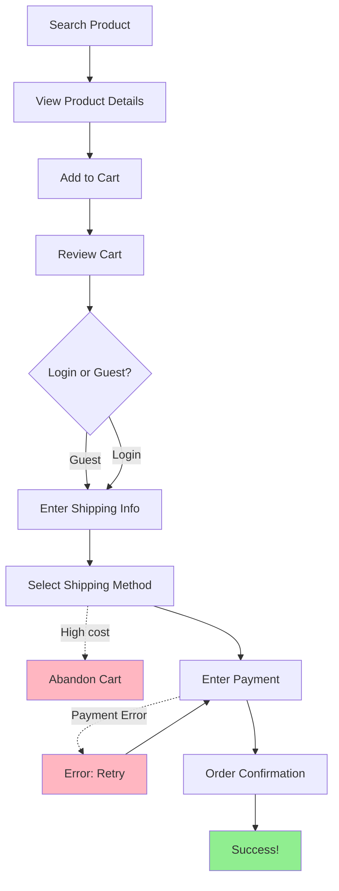
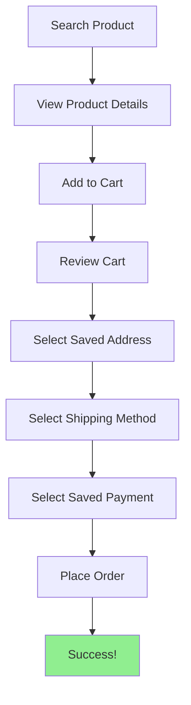
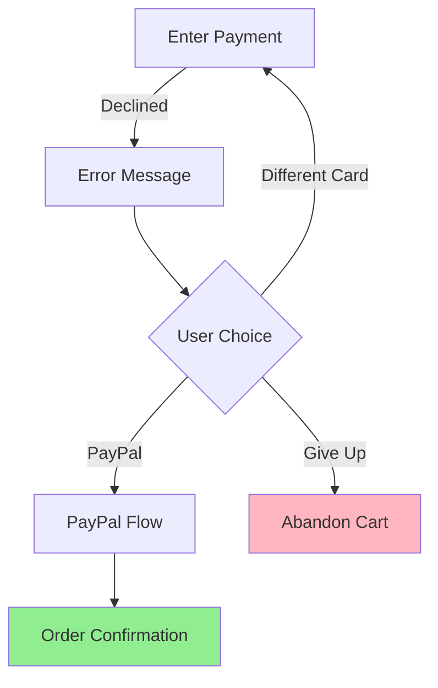
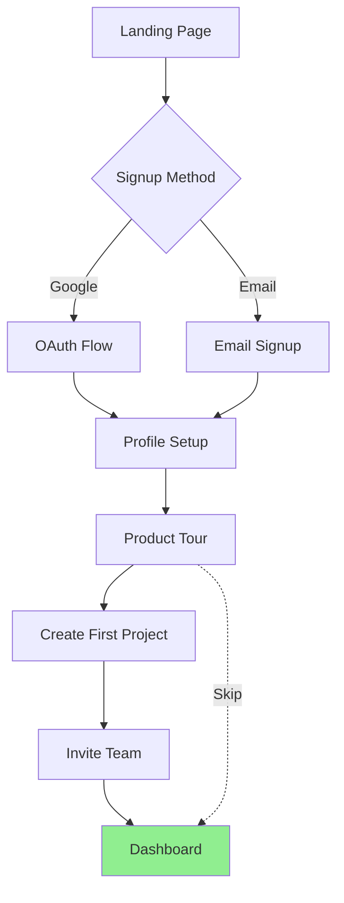

# User Journey Mapper - Reference Examples

## Example 1: E-Commerce Product Purchase Journey

### User Request
```
"Map the user journey for purchasing a product on our e-commerce site"
```

### AI Action: Context Gathering

**Questions asked:**
```
I'll help map the user journey for product purchase.

Questions:
1. Where does the user start? → Homepage, product category page, or search results
2. What is their end goal? → Complete purchase and receive order confirmation
3. Are there different paths to the same goal? → Yes - guest checkout vs logged-in user
4. Common distractions or exit points? → Shipping costs surprise, complicated checkout
5. Existing user flow diagrams? → No
```

**User answers:**
```
1. User discovers product via search or category browse
2. Goal: Complete purchase and receive confirmation
3. Two main paths: Guest checkout (faster) and logged-in (saved info)
4. Exit points: High shipping costs, payment errors, unclear return policy
5. No existing diagrams
```

### Generated Output

**File:** `docs/journeys/product-purchase-journey.md`

```markdown
# User Journey: Product Purchase

**Generated:** 2026-01-17
**Feature:** E-commerce product purchase flow
**Primary User:** Online shopper

---

## Overview

**User Goal:** Find product and complete purchase successfully
**Entry Points:**
- Homepage search
- Category browsing
- Marketing email link
- Social media ad

**Success Outcome:** Order placed, payment confirmed, confirmation email received
**Typical Duration:** 3-7 minutes (new user), 1-3 minutes (returning user)

---

## Primary Journey: First-Time Buyer

### Journey Steps

#### 1. Product Discovery - Search Results Page

**User Action:** Searches for "wireless headphones" in homepage search bar
**System Response:** Returns relevant products sorted by relevance
**User Sees:**
- Grid of product thumbnails
- Product names and prices
- Star ratings and review counts
- "Add to cart" buttons
- Filter options (price, brand, rating)

**User Emotion:** 😊 Confident - clear options presented
**Next Step:** Clicks on product that matches needs

**UI Elements:**
- Search bar with autocomplete
- Filter sidebar
- Product cards with images
- Sort dropdown (relevance, price, rating)

**Pain Points:**
- Too many options can be overwhelming
- Hard to compare products side-by-side

**Opportunities:**
- Add product comparison feature
- Show "Top Pick" badge for popular items
- Add "Recently Viewed" section

---

#### 2. Product Evaluation - Product Detail Page

**User Action:** Reviews product details, reads reviews, checks specifications
**System Response:** Displays comprehensive product information
**User Sees:**
- High-res product images (zoomable)
- Price and availability status
- Product description and specs
- Customer reviews and ratings
- Related products
- "Add to cart" button (prominent)

**User Emotion:** 😐 Evaluating - need more information
**Next Step:** Clicks "Add to cart" after reading reviews

**UI Elements:**
- Image carousel
- Specification tabs (Overview, Specs, Reviews)
- Star rating breakdown
- "Add to cart" CTA button
- Quantity selector
- Wishlist/save button

**Pain Points:**
- Reviews might be mixed, causing doubt
- Shipping cost not yet visible (surprise later)
- Return policy link hidden in footer

**Opportunities:**
- Surface shipping cost estimate earlier
- Highlight return policy prominently
- Add "Why you'll love it" section

---

#### 3. Cart Review - Shopping Cart Page

**User Action:** Reviews cart, verifies items and quantities
**System Response:** Shows cart summary with item details
**User Sees:**
- Product thumbnail, name, price
- Quantity selector
- Remove item option
- Subtotal (before shipping/tax)
- "Proceed to checkout" button
- "Continue shopping" link

**User Emotion:** 😊 Moving forward
**Next Step:** Clicks "Proceed to checkout"

**UI Elements:**
- Cart item list
- Quantity +/- buttons
- Remove/save for later links
- Promo code input
- Order summary sidebar
- Secure checkout badge

**Pain Points:**
- Shipping cost still unknown (anxiety building)
- No indication of checkout steps ahead

**Opportunities:**
- Show estimated shipping cost
- Display checkout progress bar
- Show "Free shipping over $X" banner

---

#### 4. Guest vs Login Decision - Checkout Entry

**User Action:** Chooses between guest checkout or creating account
**System Response:** Presents two clear options
**User Sees:**
- "Checkout as guest" button
- "Sign in" button
- "Create account" option
- Benefits of creating account (faster checkout, order tracking)

**User Emotion:** 😐 Decision moment
**Next Step:** Chooses guest checkout (faster)

**UI Elements:**
- Two prominent buttons
- Account benefits list
- Security badges (SSL, secure payment)

**Pain Points:**
- Pressure to create account might feel pushy
- Not clear how much info guest checkout requires

**Opportunities:**
- Clarify guest checkout is quick (3 steps)
- Offer account creation after purchase (less friction)

---

#### 5. Shipping Information - Checkout Step 1

**User Action:** Enters shipping address and contact info
**System Response:** Validates inputs, suggests address corrections
**User Sees:**
- Shipping address form (name, address, city, state, zip, phone)
- Address autocomplete suggestions
- "Save this address" checkbox (if logged in)
- Order summary sidebar (updated with items)

**User Emotion:** 😐 Routine data entry
**Next Step:** Clicks "Continue to shipping method"

**UI Elements:**
- Address form fields
- Google Places autocomplete
- Phone number input with format validation
- Progress indicator (Step 1 of 3)

**Pain Points:**
- Long form feels tedious
- No save option for guest users
- Address validation might be too strict

**Opportunities:**
- Pre-fill address from IP geolocation
- Reduce required fields (remove "Phone" if not needed)
- Offer address book for logged-in users

---

#### 6. Shipping Method - Checkout Step 2

**User Action:** Selects shipping speed
**System Response:** Shows options with costs and estimated delivery
**User Sees:**
- Radio buttons for shipping options
  - Standard (5-7 days): $5.99
  - Express (2-3 days): $12.99
  - Overnight (1 day): $24.99
- Estimated delivery dates
- Order total updated with shipping cost

**User Emotion:** 😟 Shipping cost concern (was hidden until now)
**Next Step:** Selects standard shipping, clicks "Continue to payment"

**UI Elements:**
- Shipping option cards
- Delivery date estimator
- Order summary (now includes shipping)
- Back button (edit shipping address)

**Pain Points:**
- Shipping cost higher than expected (risk of abandonment)
- Free shipping not available
- Overnight is very expensive

**Opportunities:**
- **CRITICAL**: Show shipping estimate earlier (on product page)
- Offer free shipping threshold ("Add $X more for free shipping!")
- Highlight if user qualifies for free shipping

---

#### 7. Payment Information - Checkout Step 3

**User Action:** Enters payment method
**System Response:** Validates card, processes payment
**User Sees:**
- Payment method options (credit card, PayPal, Apple Pay)
- Credit card form (number, expiry, CVV, name)
- Billing address (same as shipping checkbox)
- Order review summary
- "Place order" button
- Security badges (PCI compliant, SSL)

**User Emotion:** 😟 Anxious - entering sensitive info
**Next Step:** Clicks "Place order"

**UI Elements:**
- Payment form
- Card type icons (Visa, MC, Amex, Discover)
- CVV tooltip (what is this?)
- Billing address checkbox
- Order total (final amount)
- Place order button (green, prominent)
- Terms and conditions link

**Pain Points:**
- Payment form is long
- No visual feedback during processing (feels broken)
- Worried about security

**Opportunities:**
- Add payment processing spinner/animation
- Show "Your info is secure" message
- Support faster checkout (Apple Pay, Google Pay)
- Save card for future (with permission)

---

#### 8. Order Confirmation - Success Page

**User Action:** Reviews order confirmation
**System Response:** Displays order number and confirmation details
**User Sees:**
- "Order placed successfully!" message
- Order number
- Estimated delivery date
- Order summary (items, shipping, total)
- "View order status" link
- "Continue shopping" button

**User Emotion:** 😊 Delighted - success!
**Next Step:** Closes browser or continues shopping

**UI Elements:**
- Success checkmark icon
- Order confirmation number (large, copyable)
- Order details table
- Email confirmation notice ("Check your inbox")
- Print order button

**Pain Points:**
- None - user achieved goal

**Opportunities:**
- Upsell: "Customers also bought..."
- Encourage account creation: "Track your order by creating account"
- Ask for product review reminder

---

### Journey Diagram



---

## Alternate Journeys

### Returning User Path

**Difference from Primary:** Skips guest decision, has saved addresses and payment methods

**When This Occurs:** User is logged in and has previous orders

### Journey Diagram



**Benefits:**
- Faster checkout (2-3 minutes vs 5-7)
- Less data entry
- Better experience

---

## Error Journeys

### 1. Payment Declined

**Trigger:** Credit card declined by bank
**User Impact:** Cannot complete purchase, frustrated

**Recovery Path:**
1. User sees error message: "Your card was declined. Please try another payment method."
2. User can:
   - Try different card
   - Use PayPal
   - Contact bank
3. System: Keeps cart and shipping info saved
4. Result: User retries with different card → back to happy path



---

### 2. Out of Stock During Checkout

**Trigger:** Product sold out between adding to cart and checkout
**User Impact:** Cannot complete purchase

**Recovery Path:**
1. User sees error: "Sorry, [Product] is now out of stock."
2. User can:
   - Get notified when back in stock
   - View similar products
   - Remove from cart and continue with other items
3. Result: User either waits for restock or finds alternative

---

## Abandonment Analysis

### Common Exit Points

1. **Product Detail Page** - Shipping cost surprise anticipation
   - **Why:** User researches shipping before committing
   - **Frequency:** High
   - **Prevention:** Show shipping estimate on product page

2. **Shipping Method Selection** - Shipping cost reveal
   - **Why:** Shipping cost higher than expected
   - **Frequency:** Very High (30-40% abandon here)
   - **Prevention:** Show shipping early, offer free shipping threshold

3. **Payment Entry** - Security concerns or payment errors
   - **Why:** Don't trust site, payment method not supported, card declined
   - **Frequency:** Medium (15-20%)
   - **Prevention:** Trust badges, more payment options (PayPal, Apple Pay)

4. **Cart Review** - Second thoughts
   - **Why:** Reconsidering purchase, found better price elsewhere
   - **Frequency:** Medium
   - **Prevention:** Limited-time discount, "Only X left in stock" urgency

---

## UX Insights

### Overall Journey

**Strengths:**
- Clear product discovery with good search
- Comprehensive product details build confidence
- Multiple payment options

**Pain Points:**
- Shipping cost hidden until late in checkout (major issue)
- Guest checkout requires too much info
- No indication of checkout length/complexity
- Payment processing lacks visual feedback

**Opportunities:**
- **HIGH PRIORITY**: Show shipping estimate on product page and cart
- Add checkout progress indicator ("Step 1 of 3")
- Offer express checkout (Apple Pay, Shop Pay)
- Send cart abandonment emails with discount
- Add live chat for checkout questions
- Implement "Save cart" feature for later

### Metrics (if available)

- **Completion Rate:** 58% (industry average: 60-70%)
- **Average Duration:** 5.3 minutes
- **Drop-off Points:**
  - 42% abandon at shipping cost reveal (HIGHEST)
  - 18% abandon at payment entry
  - 12% abandon at product page

---

## Next Steps

- [ ] Review with UX team - focus on shipping cost reveal issue
- [ ] A/B test showing shipping estimate on product page
- [ ] Implement checkout progress indicator
- [ ] Set up cart abandonment email campaign
- [ ] Add Apple Pay / Google Pay for faster checkout

---

*User journey map generated by agentbootup user-journey-mapper skill*
```

---

## Example 2: User Onboarding Journey (SaaS App)

### User Request
```
"Map the onboarding journey for new users signing up for our SaaS product"
```

### Generated Output (Abbreviated)

**File:** `docs/journeys/user-onboarding-journey.md`

```markdown
# User Journey: User Onboarding (SaaS)

**Generated:** 2026-01-17
**Feature:** New user onboarding flow
**Primary User:** First-time SaaS user

---

## Overview

**User Goal:** Sign up, understand product value, complete setup
**Entry Points:**
- Landing page CTA
- Referral link
- Free trial email

**Success Outcome:** User completes profile setup, creates first project, invites team
**Typical Duration:** 10-15 minutes (engaged user), 2-3 minutes (quick setup)

---

## Primary Journey: Self-Service Signup

### Journey Steps

#### 1. Landing Page - Entry Point

**User Action:** Clicks "Start Free Trial" button
**System Response:** Redirects to signup page
**User Sees:**
- Signup form (email, password)
- "Sign up with Google" button
- Trust indicators (user count, ratings, logos)

**User Emotion:** 😐 Curious but cautious
**Next Step:** Chooses Google signup (faster)

---

#### 2. Account Creation - Signup Page

**User Action:** Clicks "Sign up with Google"
**System Response:** OAuth flow, account created
**User Sees:**
- Google OAuth permission screen
- Redirect back to app
- "Welcome!" message

**User Emotion:** 😊 Easy signup
**Next Step:** Redirected to onboarding wizard

---

#### 3. Profile Setup - Onboarding Step 1

**User Action:** Enters name, company, role
**System Response:** Saves profile info
**User Sees:**
- Welcome message with user's name
- Profile form (name, company, role dropdown)
- Progress bar (Step 1 of 4)

**User Emotion:** 😊 Making progress
**Next Step:** Clicks "Continue"

**Opportunities:**
- Pre-fill name from Google profile
- Make company/role optional (reduce friction)

---

#### 4. Product Tour - Interactive Walkthrough

**User Action:** Follows interactive product tour
**System Response:** Highlights key features
**User Sees:**
- Overlay tooltips pointing to UI elements
- "Try it" buttons for interactive steps
- Skip tour option

**User Emotion:** 😐 Learning
**Next Step:** Completes tour or skips

**Pain Points:**
- Tour might be too long (7 steps)
- Can't save progress and resume later

**Opportunities:**
- Shorten tour to 3-4 key features
- Allow "I'll explore myself" skip
- Provide video alternative

---

#### 5. First Project Creation - Onboarding Step 3

**User Action:** Creates first project
**System Response:** Project created, sample data added
**User Sees:**
- "Create your first project" form
- Project name input
- Template options (blank, sample data, import)

**User Emotion:** 😊 Achieving something
**Next Step:** Creates project with sample data

---

#### 6. Invite Team - Onboarding Step 4

**User Action:** Invites team members (optional)
**System Response:** Sends invite emails
**User Sees:**
- Team invite form (email addresses)
- "Skip for now" option
- Benefits of team collaboration

**User Emotion:** 😐 Optional step
**Next Step:** Skips (will invite later)

---

#### 7. Dashboard - Setup Complete

**User Action:** Arrives at main dashboard
**System Response:** Shows empty state with suggestions
**User Sees:**
- Main dashboard with sample project
- "What's next" checklist
- Help resources

**User Emotion:** 😊 Ready to explore!
**Next Step:** Explores features

---

### Journey Diagram



---

## UX Insights

**Strengths:**
- Google OAuth makes signup fast
- Interactive tour helps users learn
- Sample project gives immediate value

**Pain Points:**
- Onboarding flow too long (7 steps)
- Product tour not skippable early
- Users might abandon before completion

**Opportunities:**
- Reduce onboarding steps from 7 to 4
- Make tour optional and async (watch video later)
- Send onboarding completion email with tips

---

*User journey map generated by agentbootup user-journey-mapper skill*
```

---

## Key Differences from test-plan-generator

| Aspect | user-journey-mapper | test-plan-generator |
|--------|---------------------|---------------------|
| **Purpose** | UX design and workflow documentation | Feature E2E testing |
| **Focus** | User experience and flow | Functionality and validation |
| **Output** | Journey maps with diagrams | Test cases with steps |
| **Audience** | UX designers, product owners | QA engineers, developers |
| **When** | Before/during design | After implementation |
| **Includes** | Emotions, pain points, opportunities | Prerequisites, smoke tests, issue tracking |

---

## Tips for Effective User Journey Mapping

1. **Think like the user** - What do they see, feel, think at each step?
2. **Include emotions** - Use emoji or labels (Confident, Frustrated, Delighted)
3. **Map alternate paths** - Not everyone takes the happy path
4. **Identify pain points** - Where does friction occur?
5. **Show opportunities** - How can experience improve?
6. **Use diagrams** - Mermaid diagrams make flows visual and clear
7. **Track abandonment** - Where do users exit? Why?
8. **Measure when possible** - Include conversion rates, time spent, drop-off rates
