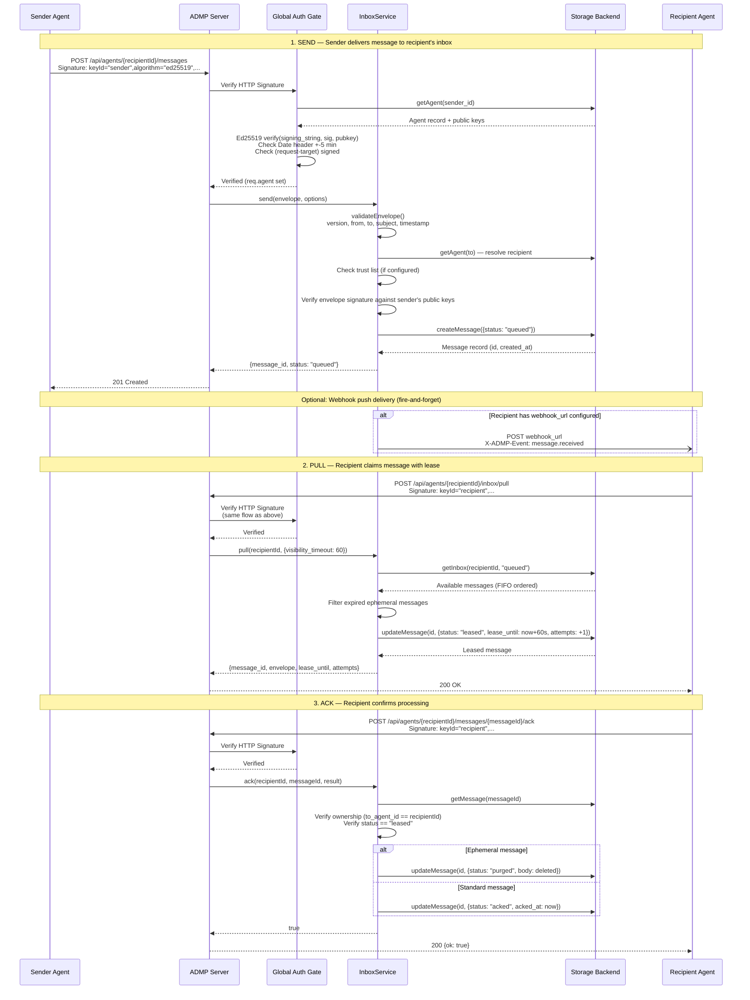

<!-- Generated: 2026-02-25T16:24:00Z -->
<!-- Source: Automated architecture analysis of agentdispatch codebase -->

# Agent Dispatch (ADMP) Architecture

**Agent Dispatch Messaging Protocol (ADMP)** -- Universal inbox for autonomous AI agents with at-least-once delivery, Ed25519 authentication, and DID federation.

---

## Table of Contents

1. [System Overview](#system-overview)
2. [Component Diagram](#component-diagram)
3. [Data Flow: Message Lifecycle](#data-flow-message-lifecycle)
4. [Deployment Topology](#deployment-topology)
5. [Runtime and Deployment](#runtime-and-deployment)
6. [Source Code Layout](#source-code-layout)
7. [Services Architecture](#services-architecture)
8. [Authentication Model](#authentication-model)
9. [Security](#security)
10. [Storage Backends](#storage-backends)
11. [Background Jobs](#background-jobs)
12. [API Route Map](#api-route-map)
13. [Environment Variables](#environment-variables)
14. [Dependencies](#dependencies)

---

## System Overview

ADMP is a messaging protocol for autonomous AI agents built on two principles:

1. Every agent has an **inbox**.
2. Every message follows the same **contract** regardless of transport.

The server provides HTTP REST endpoints for agent registration, message send/pull/ack/nack/reply, group messaging with fanout, outbound email via Mailgun, DID-based identity discovery, and a full approval workflow for agent onboarding. Authentication uses Ed25519 HTTP Signatures with fallback to API key authentication. Federation is supported through DID:web resolution with SSRF-hardened outbound fetches.

---

## Component Diagram

```mermaid
graph TB
    subgraph Clients
        A1[Agent A<br/>Ed25519 Keypair]
        A2[Agent B<br/>Ed25519 Keypair]
        A3[Admin<br/>Master API Key]
        A4[External DID:web Agent<br/>Federated]
    end

    subgraph "Fly.io — agentdispatch"
        subgraph "Express Server :8080"
            MW_HELMET[helmet<br/>Security Headers]
            MW_CORS[cors<br/>Origin Control]
            MW_JSON[express.json<br/>10MB limit]
            MW_PINO[pino-http<br/>Structured Logging]
            MW_AUTH[Global Auth Gate<br/>HTTP Signature → API Key]

            MW_HELMET --> MW_CORS --> MW_JSON --> MW_PINO --> MW_AUTH

            subgraph "Route Handlers"
                R_AGENTS["/api/agents/*"<br/>Registration, Heartbeat,<br/>Trust, Webhook, Identity,<br/>Key Rotation, Tenants,<br/>Approval Workflow]
                R_INBOX["/api/agents/:id/inbox/*"<br/>Send, Pull, Ack,<br/>Nack, Reply, Stats]
                R_GROUPS["/api/groups/*"<br/>CRUD, Membership,<br/>Join/Leave, Fanout]
                R_OUTBOX["/api/agents/:id/outbox/*"<br/>Domain Config, Send,<br/>Message Queries]
                R_DISCOVERY["/.well-known/agent-keys.json"<br/>"/api/agents/:id/did.json"<br/>Key Directory & DID Docs]
                R_WEBHOOKS["/api/webhooks/mailgun"<br/>Delivery Status]
            end

            subgraph "Services"
                S_AGENT[AgentService<br/>Registration, Heartbeat,<br/>Trust, Key Rotation,<br/>Approval Workflow]
                S_INBOX[InboxService<br/>Send, Pull, Ack,<br/>Nack, Reply, TTL,<br/>Ephemeral Messages]
                S_GROUP[GroupService<br/>CRUD, Membership,<br/>RBAC, Message Fanout]
                S_OUTBOX[OutboxService<br/>Mailgun Send,<br/>Domain Management,<br/>Webhook Handling]
                S_IDENTITY[IdentityService<br/>GitHub Linking,<br/>Cryptographic Tier]
                S_WEBHOOK[WebhookService<br/>Push Delivery,<br/>Retry with Backoff]
            end
        end

        subgraph "Storage Layer"
            STORE_IDX[storage/index.js<br/>Backend Selector]
            STORE_MEM[memory.js<br/>In-Process Maps]
            STORE_MECH[mech.js<br/>HTTP Client]
        end

        subgraph "Background Jobs"
            BG_CLEANUP[Cleanup Timer<br/>Lease Reclaim,<br/>TTL Expiry,<br/>Ephemeral Purge]
            BG_HEARTBEAT[Heartbeat Timer<br/>Mark Offline Agents]
        end
    end

    subgraph "External Services"
        MECH[("Mech Storage API<br/>MECH_BASE_URL")]
        MAILGUN[("Mailgun API<br/>api.mailgun.net/v3")]
        DID_WEB[("DID:web Servers<br/>External Domains")]
    end

    A1 & A2 -->|HTTPS + Ed25519 Sig| MW_HELMET
    A3 -->|HTTPS + Master API Key| MW_HELMET
    A4 -->|HTTPS + DID:web Sig| MW_HELMET

    MW_AUTH --> R_AGENTS & R_INBOX & R_GROUPS & R_OUTBOX & R_DISCOVERY & R_KEYS & R_WEBHOOKS

    R_AGENTS --> S_AGENT
    R_AGENTS --> S_IDENTITY
    R_INBOX --> S_INBOX
    R_GROUPS --> S_GROUP
    R_OUTBOX --> S_OUTBOX
    R_WEBHOOKS --> S_OUTBOX

    S_INBOX --> S_WEBHOOK
    S_GROUP --> S_INBOX

    S_AGENT & S_INBOX & S_GROUP & S_OUTBOX & S_IDENTITY --> STORE_IDX
    STORE_IDX -->|STORAGE_BACKEND=memory| STORE_MEM
    STORE_IDX -->|STORAGE_BACKEND=mech| STORE_MECH
    STORE_MECH -->|HTTPS| MECH

    S_OUTBOX -->|HTTPS + Basic Auth| MAILGUN
    MW_AUTH -->|DID:web Resolution| DID_WEB

    BG_CLEANUP --> S_INBOX
    BG_CLEANUP --> STORE_IDX
    BG_HEARTBEAT --> S_AGENT
```

---

## Data Flow: Message Lifecycle

### Primary Flow: Send, Pull, Ack



### Message State Machine

```
                          +-----------+
                          |  queued   |
                          +-----+-----+
                                |
                    pull()      |      TTL expires
                   +-----------++-----------+
                   |                        |
             +-----v-----+           +-----v-----+
             |  leased    |           |  expired   |
             +-----+-----+           +-----------+
                   |
          +--------+--------+
          |                 |
     ack()                nack()
          |                 |
    +-----v-----+    +-----+-----+
    |  acked     |    |  queued   | (requeue)
    +-----+-----+    +-----------+
          |
          | (if ephemeral)
          |
    +-----v-----+
    |  purged    | (body deleted, metadata retained)
    +-----------+
```

### Alternate Flows

**NACK with lease extension:**
```
Recipient -> Server: POST /.../nack {extend_sec: 120}
Server -> Storage: updateMessage(id, {lease_until: base + 120s})
```

**Reply (correlated response):**
```
Recipient -> Server: POST /.../reply {envelope}
Server -> InboxService: reply(agentId, originalMessageId, envelope)
InboxService -> InboxService: send({...envelope, to: original.from, correlation_id: originalMessageId})
```

**Group Fanout:**
```
Sender -> Server: POST /api/groups/{groupId}/messages {subject, body}
GroupService: verify sender membership
GroupService: for each member (except sender):
    InboxService.send({...envelope, to: member.agent_id, id: uuid()})
```

---

## Deployment Topology

```mermaid
graph LR
    subgraph Internet
        AGENTS[AI Agents<br/>& Admin Clients]
    end

    subgraph "Fly.io — Region: dfw"
        LB[Fly.io<br/>Load Balancer<br/>HTTPS Termination]

        subgraph "App Instance"
            NODE["Node.js 18 Alpine<br/>Express 4<br/>Port 8080"]
        end

        LB -->|HTTP :8080| NODE
    end

    subgraph "External APIs"
        MECH_API["Mech Storage API<br/>https://MECH_BASE_URL<br/>(Persistent Data)"]
        MAILGUN_API["Mailgun API<br/>https://api.mailgun.net/v3<br/>(Outbound Email)"]
        DID_SERVERS["DID:web Servers<br/>(Federation)"]
    end

    AGENTS -->|HTTPS| LB
    NODE -->|HTTPS| MECH_API
    NODE -->|HTTPS + Basic Auth| MAILGUN_API
    NODE -->|HTTPS (5s timeout)| DID_SERVERS
    MAILGUN_API -.->|Webhook POST| LB

    style NODE fill:#2d6,stroke:#333
    style LB fill:#48f,stroke:#333
```

**Scaling characteristics:**
- `auto_stop_machines = stop` -- instances scale to zero when idle
- `auto_start_machines = true` -- cold-start on first request
- `min_machines_running = 0` -- no always-on cost
- 1 shared CPU, 1 GB memory per VM
- Health check: `GET /health` every 15 seconds

---

## Runtime and Deployment

| Property | Value |
|---|---|
| **Runtime** | Node.js 18 (Alpine Docker image) |
| **Framework** | Express 4 with helmet, cors, pino logging |
| **Deployment** | Fly.io (app: `agentdispatch`, region: `dfw`) |
| **Port** | 8080 (internal), HTTPS forced by Fly.io |
| **Entry point** | `node src/index.js` |
| **Docker base** | `node:18-alpine` |
| **Install** | `npm ci --only=production` |
| **Health check** | Docker: every 30s via `/health`; Fly.io: every 15s via `GET /health` |
| **Graceful shutdown** | SIGTERM/SIGINT handlers stop background jobs, close server |

---

## Source Code Layout

```
src/
  index.js                    # Entry point — starts server, background jobs, graceful shutdown
  server.js                   # Express app setup — middleware chain, route mounting, background job lifecycle
  server.test.js              # Integration tests (node --test)

  middleware/
    auth.js                   # Authentication: HTTP Signatures, API keys, DID:web federation,
                              #   enrollment tokens, approval gate, SSRF protection

  routes/
    agents.js                 # /api/agents/* — registration, heartbeat, trust, webhook,
                              #   identity verification, key rotation, tenants, approval
    inbox.js                  # /api/agents/:id/inbox/* — send, pull, ack, nack, reply,
                              #   stats, reclaim; /api/messages/:id/status
    groups.js                 # /api/groups/* — CRUD, membership, join/leave, messages
    outbox.js                 # /api/agents/:id/outbox/* — domain config, send email,
                              #   message queries; /api/webhooks/mailgun
    discovery.js              # /.well-known/agent-keys.json — JWKS key directory
                              # /api/agents/:id/did.json — W3C DID document
  services/
    agent.service.js          # Agent lifecycle: register (3 modes), heartbeat, approve/reject,
                              #   trust management, webhook config, key rotation
    inbox.service.js          # Message lifecycle: send, pull, ack, nack, reply, ephemeral purge
    group.service.js          # Group lifecycle: CRUD, RBAC membership, message fanout
    outbox.service.js         # Outbound email: Mailgun HTTP API, domain management, webhook handling
    identity.service.js       # Verification tiers: GitHub linking, cryptographic confirmation
    webhook.service.js        # Push delivery: HTTP POST with HMAC signing, exponential backoff retry

  storage/
    index.js                  # Backend selector (STORAGE_BACKEND env var)
    memory.js                 # In-process Maps for development/testing
    mech.js                   # HTTP client for Mech Storage API (production)

  utils/
    crypto.js                 # Ed25519 keypair generation (tweetnacl), HKDF-SHA256,
                              #   message signing/verification, HTTP request signing,
                              #   DID generation, timestamp validation, TTL parsing
```

---

## Services Architecture

### AgentService

Manages the full agent lifecycle.

| Capability | Description |
|---|---|
| **Registration** | Three modes: *Legacy* (random keypair), *Seed-based* (HKDF deterministic), *Import* (client-provided public key) |
| **Heartbeat** | Periodic liveness signal; background job marks agents offline after `timeout_ms` |
| **Approval Workflow** | `approve()` / `reject(reason)` for pending agents; master key required |
| **Trust Management** | Per-agent trusted/blocked agent lists; enforced at message send time |
| **Webhook Config** | Configure/remove push delivery URL with auto-generated HMAC secret |
| **Key Rotation** | Seed-based agents only; derives new version via HKDF; 24-hour rotation window for old keys |

### InboxService

Core message processing engine.

| Operation | Description |
|---|---|
| **send()** | Validates envelope, resolves recipient (agent:// or did:seed:), checks trust list, verifies signature against all active keys, persists with status `queued`, triggers optional webhook push |
| **pull()** | FIFO retrieval with visibility timeout (lease); filters expired ephemeral messages |
| **ack()** | Confirms processing; ephemeral messages have body purged on ack |
| **nack()** | Requeue or extend lease duration |
| **reply()** | Creates correlated response routed back to original sender |
| **Ephemeral messages** | `ephemeral: true` purges body on ack; `ttl` auto-purges after time |

### GroupService

Multi-agent group messaging with role-based access control.

| Capability | Description |
|---|---|
| **CRUD** | Create, read, update, delete groups |
| **Access types** | `open`, `key-protected` (SHA-256 hashed join key), `invite-only` |
| **Roles** | `owner`, `admin`, `member` -- with permission checks on mutations |
| **Message fanout** | Post to group fans out as individual messages to each member's inbox (via InboxService) |
| **History** | Configurable `history_visible` flag; deduplicated by `group_message_id` |
| **Limits** | `max_members` (default 50), `message_ttl_sec` (default 7 days) |

### OutboxService

Outbound email delivery through Mailgun.

| Capability | Description |
|---|---|
| **Domain management** | Add, verify DNS, remove custom sending domains |
| **Send** | Constructs RFC 5322 From header, sends via Mailgun HTTP API |
| **Retry** | Exponential backoff (1s, 2s, 4s), max 3 attempts |
| **Webhooks** | Receives Mailgun delivery/bounce events; HMAC-SHA256 signature verification |
| **Status tracking** | `queued` -> `sent` -> `delivered` or `failed` |

### IdentityService

Tiered identity verification for agents.

| Tier | Requirements |
|---|---|
| `unverified` | Default on registration |
| `github` | Agent links a GitHub handle (claim-based, no OAuth in Phase 1) |
| `cryptographic` | Seed-based registration with DID; strongest tier |

### WebhookService

Push delivery of messages to agent webhook endpoints.

| Capability | Description |
|---|---|
| **Delivery** | HTTP POST with `User-Agent: ADMP-Server/1.0`, custom `X-ADMP-*` headers |
| **Signing** | HMAC-SHA256 of payload using agent's `webhook_secret` |
| **Retry** | Exponential backoff (1s, 2s, 4s), max 3 attempts |
| **Headers** | `X-ADMP-Event`, `X-ADMP-Message-ID`, `X-ADMP-Delivery-Attempt` |

---

## Authentication Model

Authentication is enforced by a global middleware gate on all `/api/*` routes (except `POST /api/agents/register`).

```
Request arrives at /api/*
        |
        v
  Is POST /api/agents/register?
        |
   yes -+-> BYPASS (no auth required)
        |
   no --+-> Does Signature header exist?
              |
         yes -+-> Verify Ed25519 HTTP Signature
              |       |
              |  valid +-> Check agent approval status
              |       |       |
              |       |  approved -> Set req.agent, req.authMethod = 'http-signature'
              |       |       |      Authorization check: signing agent == URL target agent
              |       |       |      -> NEXT (bypass API key)
              |       |       |
              |       |  pending -> 403 REGISTRATION_PENDING
              |       |  rejected -> 403 REGISTRATION_REJECTED
              |       |
              |  invalid -> 401 SIGNATURE_INVALID (NO fallthrough to API key)
              |
         no --+-> requireApiKey()
                    |
                    +-> API_KEY_REQUIRED == "true"?
                         |
                    no --+-> NEXT (no auth)
                         |
                    yes -+-> Extract key from X-Api-Key or Authorization: Bearer
                              |
                              +-> Constant-time compare against MASTER_API_KEY
                              |       match -> req.apiKeyType = 'master' -> NEXT
                              |
                              +-> SHA-256 hash lookup in storage (issued keys)
                                    |
                                    +-> Check: not revoked, not expired
                                    +-> Check: single_use -> not already used_at
                                    +-> Check: target_agent_id scope matches URL
                                    +-> Atomic burn for single-use tokens
                                    +-> req.apiKeyType = 'issued' -> NEXT
                                    |
                                    +-> None matched -> 401 INVALID_API_KEY
```

### HTTP Signature Format

```
Signature: keyId="<agent_id or DID>",
           algorithm="ed25519",
           headers="(request-target) host date",
           signature="<base64>"
```

**Signing string construction:**
```
(request-target): <method lowercase> <path>
host: <host header>
date: <date header>
```

**Requirements:**
- `(request-target)` MUST be signed (binds signature to specific endpoint)
- `date` MUST be signed (replay protection)
- Date header freshness: +/- 5 minutes
- Only `ed25519` algorithm accepted

### DID:web Federation

When a `Signature` header contains `keyId="did:web:..."`:

1. Parse DID to derive document URL per W3C spec
2. SSRF check: block private IPs, loopback, link-local, CGNAT, raw IPv6
3. If `DID_WEB_ALLOWED_DOMAINS` is set, only those domains are permitted
4. Fetch DID document (5s timeout, 64KB limit, redirect validation)
5. Extract Ed25519 verification methods
6. Cache keys for 5 minutes (bounded to 1000 entries)
7. Create or retrieve shadow agent (`agent_type: "federated"`)
8. Auto-approve only if `REGISTRATION_POLICY=open` AND domain is in allowlist

---

## Security

### Cryptographic Primitives

| Primitive | Implementation | Usage |
|---|---|---|
| **Ed25519 signatures** | tweetnacl `nacl.sign.detached` | HTTP Signature auth, message envelope signatures |
| **HKDF-SHA256** | Node.js `crypto.createHmac` | Deterministic key derivation for seed-based agents |
| **SHA-256** | Node.js `crypto.createHash` | API key hashing, DID fingerprints, group join key hashing |
| **HMAC-SHA256** | Node.js `crypto.createHmac` | Webhook payload signing, Mailgun webhook verification |

### Defenses

| Threat | Mitigation |
|---|---|
| **Timing attacks on API keys** | `crypto.timingSafeEqual` for master key comparison; issued keys use hash lookup (timing-safe by design) |
| **Replay attacks** | `Date` header must be signed and within +/- 5 minutes of server time |
| **Endpoint confusion** | `(request-target)` must be in signed headers; signing agent must match URL target agent |
| **Signature fallthrough** | If `Signature` header is present but invalid, reject immediately -- never fall through to API key auth |
| **SSRF via DID:web** | Private IP blocklist (127.0.0.0/8, 10.0.0.0/8, 172.16.0.0/12, 192.168.0.0/16, 169.254.0.0/16, 100.64.0.0/10, 0.0.0.0/8, ::1, all raw IPv6); redirect target validation; `DID_WEB_ALLOWED_DOMAINS` allowlist; 5s fetch timeout; 64KB document size limit |
| **DID key cache DoS** | Cache bounded to 1000 entries; oldest entry evicted on overflow |
| **Enrollment token reuse** | Atomic `burnSingleUseKey()` with TOCTOU race protection; `used_at` set only if currently null |
| **Enrollment token scope** | `target_agent_id` validated against URL path; tokens cannot access other agents' endpoints |
| **Algorithm confusion** | Only `ed25519` accepted; any other `algorithm` value is rejected |
| **Multicodec confusion** | DID document keys must be exactly 34 bytes with `0xed01` prefix; other key types rejected |
| **Namespace collision** | Shadow agent creation checks for existing non-federated agent with same ID |
| **HTTP headers** | `helmet` middleware sets security headers (X-Content-Type-Options, X-Frame-Options, etc.) |
| **Input validation** | 10MB JSON body limit; group name length/charset validation; rejection reason 500 char limit; From header sanitization for outbox |
| **Error response uniformity** | 401 for all bad-credential scenarios (expired, revoked, unknown) to prevent existence leaking |

### Approval Workflow

```
Agent registers
       |
       v
  REGISTRATION_POLICY?
       |
  "open" ---------> status: approved (immediate access)
       |
  "approval_required" -> status: pending
       |                     |
       |              Admin POST /:agentId/approve -> status: approved
       |              Admin POST /:agentId/reject  -> status: rejected
       |
  Tenant override: tenant.registration_policy takes precedence over env var
```

DID:web federated agents follow a stricter policy: even under `open` registration, they default to `pending` unless `DID_WEB_ALLOWED_DOMAINS` includes their domain.

---

## Storage Backends

Selected via `STORAGE_BACKEND` environment variable.

### Memory Backend (default)

- In-process JavaScript `Map` objects
- Zero dependencies
- Data lost on restart
- Suitable for development and testing

### Mech Backend (production)

- HTTP client for the Mech Storage API at `MECH_BASE_URL`
- Persistent data across restarts
- Used in Fly.io production deployment

### Storage Interface

Both backends implement the same interface:

| Category | Methods |
|---|---|
| **Agents** | `createAgent`, `getAgent`, `getAgentByDid`, `updateAgent`, `deleteAgent`, `listAgents`, `getAgentsByTenant` |
| **Messages** | `createMessage`, `getMessage`, `updateMessage`, `getInbox`, `getInboxStats`, `expireLeases`, `expireMessages`, `cleanupExpiredMessages`, `purgeExpiredEphemeralMessages` |
| **Groups** | `createGroup`, `getGroup`, `updateGroup`, `deleteGroup`, `listGroups`, `addGroupMember`, `removeGroupMember`, `isGroupMember`, `getGroupMembers`, `getGroupMessages` |
| **Tenants** | `createTenant`, `getTenant`, `deleteTenant` |
| **Issued Keys** | `createIssuedKey`, `getIssuedKeyByHash`, `listIssuedKeys`, `revokeIssuedKey`, `burnSingleUseKey` |
| **Outbox** | `createOutboxMessage`, `getOutboxMessage`, `updateOutboxMessage`, `getOutboxMessages`, `findOutboxMessageByMailgunId` |
| **Domain Config** | `getDomainConfig`, `setDomainConfig`, `deleteDomainConfig` |
| **Stats** | `getStats` |

---

## Background Jobs

Two `setInterval` timers started after the server begins listening. Both run every `CLEANUP_INTERVAL_MS` (default 60 seconds).

### Cleanup Job

| Task | Description |
|---|---|
| **Reclaim expired leases** | Messages with `status: leased` past `lease_until` are reset to `queued` |
| **Expire messages** | Messages past their `ttl_sec` are moved to `expired` status |
| **Delete expired messages** | Removes messages that have been in `expired` status |
| **Purge ephemeral messages** | Ephemeral messages past their `expires_at` have body stripped, status set to `purged` |

### Heartbeat Job

| Task | Description |
|---|---|
| **Mark offline agents** | Agents with `heartbeat.status: online` whose `last_heartbeat` exceeds `timeout_ms` are marked `offline` |

---

## API Route Map

### Public Endpoints (no authentication)

| Method | Path | Description |
|---|---|---|
| `GET` | `/health` | Health check (`{status, timestamp, version}`) |
| `GET` | `/docs` | Swagger UI (OpenAPI documentation) |
| `GET` | `/openapi.json` | Raw OpenAPI specification |
| `POST` | `/api/agents/register` | Agent self-registration |
| `GET` | `/.well-known/agent-keys.json` | JWKS-style public key directory |

### Agent Endpoints (HTTP Signature or API Key)

| Method | Path | Description |
|---|---|---|
| `GET` | `/api/agents/:agentId` | Get agent details |
| `DELETE` | `/api/agents/:agentId` | Deregister agent |
| `POST` | `/api/agents/:agentId/heartbeat` | Update heartbeat |
| `GET` | `/api/agents/:agentId/trusted` | List trusted agents |
| `POST` | `/api/agents/:agentId/trusted` | Add trusted agent |
| `DELETE` | `/api/agents/:agentId/trusted/:trustedAgentId` | Remove trusted agent |
| `POST` | `/api/agents/:agentId/webhook` | Configure webhook |
| `GET` | `/api/agents/:agentId/webhook` | Get webhook config |
| `DELETE` | `/api/agents/:agentId/webhook` | Remove webhook |
| `GET` | `/api/agents/:agentId/groups` | List agent's groups |
| `POST` | `/api/agents/:agentId/rotate-key` | Rotate key (seed-based only) |
| `POST` | `/api/agents/:agentId/verify/github` | Link GitHub handle |
| `POST` | `/api/agents/:agentId/verify/cryptographic` | Confirm cryptographic tier |
| `GET` | `/api/agents/:agentId/identity` | Get verification status |
| `GET` | `/api/agents/:agentId/did.json` | W3C DID document |

### Inbox Endpoints

| Method | Path | Auth | Description |
|---|---|---|---|
| `POST` | `/api/agents/:agentId/messages` | API Key | Send message to inbox |
| `POST` | `/api/agents/:agentId/inbox/pull` | HTTP Sig | Pull message (with lease) |
| `POST` | `/api/agents/:agentId/messages/:messageId/ack` | HTTP Sig | Acknowledge message |
| `POST` | `/api/agents/:agentId/messages/:messageId/nack` | HTTP Sig | Negative acknowledge |
| `POST` | `/api/agents/:agentId/messages/:messageId/reply` | HTTP Sig | Reply to message |
| `GET` | `/api/agents/:agentId/inbox/stats` | HTTP Sig | Inbox statistics |
| `POST` | `/api/agents/:agentId/inbox/reclaim` | HTTP Sig | Reclaim expired leases |
| `GET` | `/api/messages/:messageId/status` | API Key | Get message delivery status |

### Group Endpoints (Agent Auth)

| Method | Path | Description |
|---|---|---|
| `POST` | `/api/groups` | Create group |
| `GET` | `/api/groups/:groupId` | Get group info |
| `PUT` | `/api/groups/:groupId` | Update group (admin/owner) |
| `DELETE` | `/api/groups/:groupId` | Delete group (owner) |
| `GET` | `/api/groups/:groupId/members` | List members |
| `POST` | `/api/groups/:groupId/members` | Add member (admin/owner) |
| `DELETE` | `/api/groups/:groupId/members/:agentId` | Remove member |
| `POST` | `/api/groups/:groupId/join` | Join group (open/key) |
| `POST` | `/api/groups/:groupId/leave` | Leave group |
| `POST` | `/api/groups/:groupId/messages` | Post message (fanout) |
| `GET` | `/api/groups/:groupId/messages` | Get message history |

### Outbox Endpoints (Agent Auth)

| Method | Path | Description |
|---|---|---|
| `POST` | `/api/agents/:agentId/outbox/domain` | Configure sending domain |
| `GET` | `/api/agents/:agentId/outbox/domain` | Get domain config |
| `POST` | `/api/agents/:agentId/outbox/domain/verify` | Verify domain DNS |
| `DELETE` | `/api/agents/:agentId/outbox/domain` | Remove domain |
| `POST` | `/api/agents/:agentId/outbox/send` | Send email |
| `GET` | `/api/agents/:agentId/outbox/messages` | List sent messages |
| `GET` | `/api/agents/:agentId/outbox/messages/:messageId` | Get message status |

### Admin Endpoints (Master API Key)

| Method | Path | Description |
|---|---|---|
| `POST` | `/api/agents/:agentId/approve` | Approve pending agent |
| `POST` | `/api/agents/:agentId/reject` | Reject agent |
| `GET` | `/api/agents/tenants/:tenantId/pending` | List pending agents |

### Tenant Endpoints (API Key)

| Method | Path | Description |
|---|---|---|
| `POST` | `/api/agents/tenants` | Create tenant |
| `GET` | `/api/agents/tenants/:tenantId` | Get tenant |
| `GET` | `/api/agents/tenants/:tenantId/agents` | List tenant agents |
| `DELETE` | `/api/agents/tenants/:tenantId` | Delete tenant |

### Webhook Endpoints (Mailgun)

| Method | Path | Description |
|---|---|---|
| `POST` | `/api/webhooks/mailgun` | Mailgun delivery status callback |

### Stats Endpoint

| Method | Path | Description |
|---|---|---|
| `GET` | `/api/stats` | System-wide statistics |

---

## Environment Variables

| Variable | Default | Description |
|---|---|---|
| `PORT` | `8080` | Server listening port |
| `NODE_ENV` | `production` | Node.js environment (`production` = info-level logging, generic error messages) |
| `CORS_ORIGIN` | `*` | Allowed CORS origins |
| `API_KEY_REQUIRED` | `true` | Enforce API key authentication on `/api/*` routes |
| `MASTER_API_KEY` | *(none, required for admin)* | Master key for admin endpoints (key issuance, agent approval/rejection). **Secret -- set via Fly.io secrets, never in fly.toml.** |
| `HEARTBEAT_INTERVAL_MS` | `60000` | Agent heartbeat expected interval (informational, logged at startup) |
| `HEARTBEAT_TIMEOUT_MS` | `300000` | Time after last heartbeat before agent is marked offline |
| `MESSAGE_TTL_SEC` | `86400` | Default message time-to-live (24 hours) |
| `CLEANUP_INTERVAL_MS` | `60000` | Interval for background cleanup and heartbeat check jobs |
| `MAX_MESSAGE_SIZE_KB` | `256` | Maximum message size (configured, enforcement in storage layer) |
| `MAX_MESSAGES_PER_AGENT` | `1000` | Maximum inbox messages per agent (configured, enforcement in storage layer) |
| `STORAGE_BACKEND` | `mech` (fly.toml) / `memory` (code default) | Storage backend: `memory` or `mech` |
| `MECH_BASE_URL` | *(deployment-specific)* | Mech Storage API base URL (when `STORAGE_BACKEND=mech`) |
| `REGISTRATION_POLICY` | `approval_required` (fly.toml) / `open` (code default) | Agent registration policy: `open` or `approval_required`. Tenant-level policy overrides. |
| `DID_WEB_ALLOWED_DOMAINS` | *(none)* | Comma-separated domain allowlist for DID:web federation. When set, only listed domains can federate. When unset, all public domains can attempt federation (subject to SSRF blocklist). |
| `MAILGUN_API_KEY` | *(none)* | Mailgun API key for outbound email. **Secret.** |
| `MAILGUN_API_URL` | `https://api.mailgun.net/v3` | Mailgun API base URL (override for EU regions or testing) |
| `MAILGUN_WEBHOOK_SIGNING_KEY` | *(none)* | Mailgun webhook signing key for verifying delivery callbacks. **Secret.** When unset, webhooks accept unauthenticated requests (warning logged). |

---

## Dependencies

### Production

| Package | Version | Purpose |
|---|---|---|
| `express` | ^4.18.2 | HTTP framework |
| `cors` | ^2.8.5 | Cross-origin resource sharing middleware |
| `helmet` | ^7.1.0 | Security headers middleware |
| `pino` | ^8.16.2 | Structured JSON logging |
| `pino-http` | ^8.5.1 | HTTP request/response logging |
| `tweetnacl` | ^1.0.3 | Ed25519 keypair generation and signature verification |
| `uuid` | ^9.0.1 | UUID v4 generation for message and agent IDs |
| `swagger-ui-express` | ^5.0.1 | API documentation UI at `/docs` |
| `yamljs` | ^0.3.0 | OpenAPI YAML spec loading |
| `dotenv` | ^17.2.3 | Environment variable loading from `.env` files |

### Development

| Package | Version | Purpose |
|---|---|---|
| `supertest` | ^6.3.4 | HTTP assertion testing |
| `nodemon` | ^3.0.2 | Auto-restart on file changes (dev mode) |
| `agentbootup` | ^0.7.1 | Agent skill and memory management framework |

### Node.js Built-ins Used

| Module | Purpose |
|---|---|
| `node:crypto` | `timingSafeEqual`, `createHash`, `createHmac`, `randomBytes` |
| `node:url` | `fileURLToPath` for ESM `__dirname` emulation |
| `node:path` | Path joining for OpenAPI spec loading |
